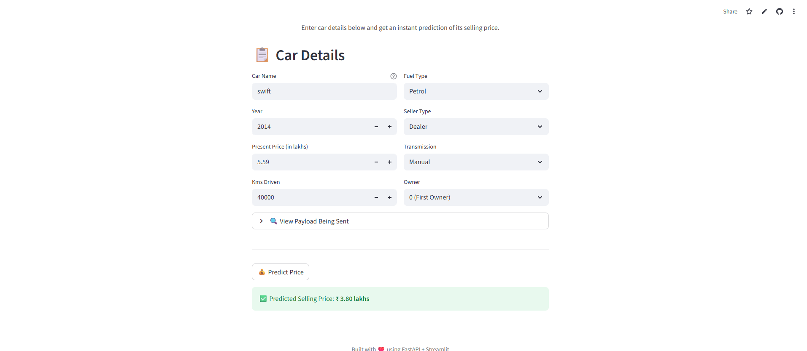

# Car Price Prediction System

A full-stack machine learning application that predicts used car prices based on various features using a Random Forest Regressor model.

## Screenshot


## Project Structure

```
project_root/
│── __init__.py
│── main.py
│── model.py        
│── schema.py
│── streamlit_app.py
├── random_forest_model.pkl
├── feature_columns.pkl
└── car_price_prediction.py

```

## Live Demo

**Frontend (Streamlit):**
👉 https://car-price-prediction-fwmnyp4ygc6gdwrb9stc87.streamlit.app/

**Backend API (FastAPI):**
👉 https://car-price-prediction-o3xf.onrender.com/

**API Documentation (Swagger UI):**
👉 https://car-price-prediction-o3xf.onrender.com/docs


## Model Details

**Algorithm:** Random Forest Regressor

**R² Score:** 0.9655

**Estimators:** 500

**Train/Test Split:** 80/20

**Total Features:** 106 (after encoding)


## Dataset

**Source:** CarDekho

**Records:** 301

**Target:** Selling_Price (₹ lakhs)

**Year Range:** 2003–2018

## Credits

Developed by Sumit Kumar Mandal

B.tech Computer Science and Engineering-2026

## License

This project is for education and personal use.

